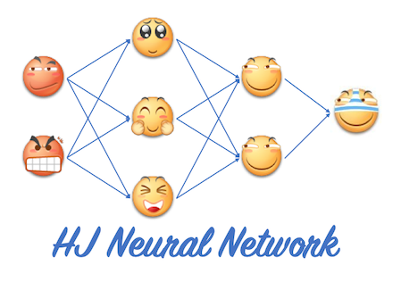

# HJNN
HJNN is a toy neural network that illustrates how forward and backward propagation work.

NOTE layers are fully connected in HJNN.
### Usage
create a network
```cpp
vector<LayerInfo> info;
info.emplace_back(2,LINEAR);//input layer
info.emplace_back(2,SIGMOID);//hidden layer
info.emplace_back(1,LINEAR);//output layer
HJNN hjnn(info);
```
or load an existing model
```cpp
HJNN hjnn("normal.model");
```


train and predict
```cpp
auto data=genrate2ClassNormalData2d(x1,y1,delta1,x2,y2,delta2,dataNum);
hjnn.train(data.first,data.second,threshold,rounds,learningRate);
auto result=hjnn.predict(data.first);
```
save a trained model
```cpp
hjnn.saveModel("myModel.model");
```